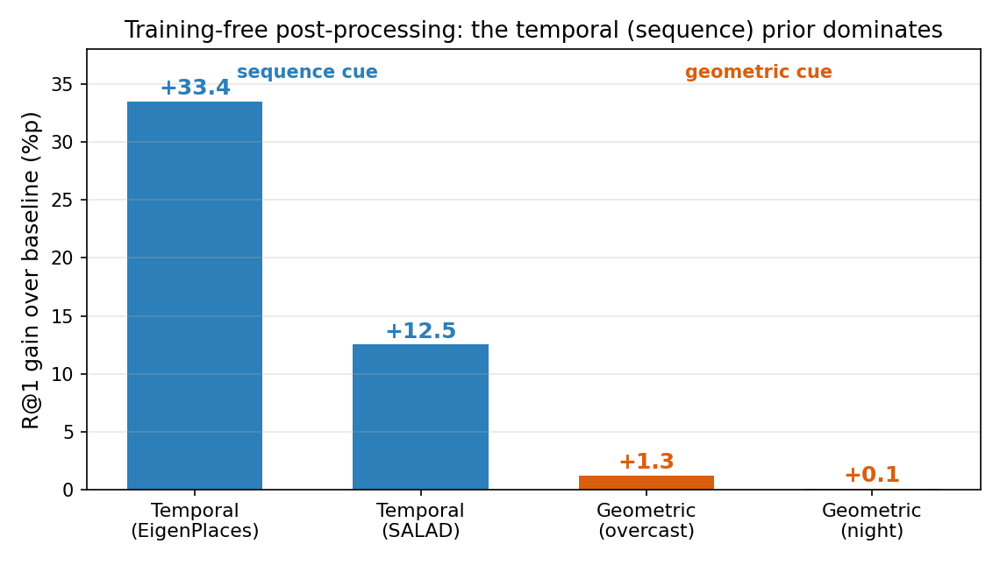
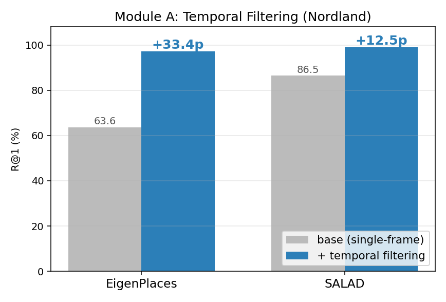
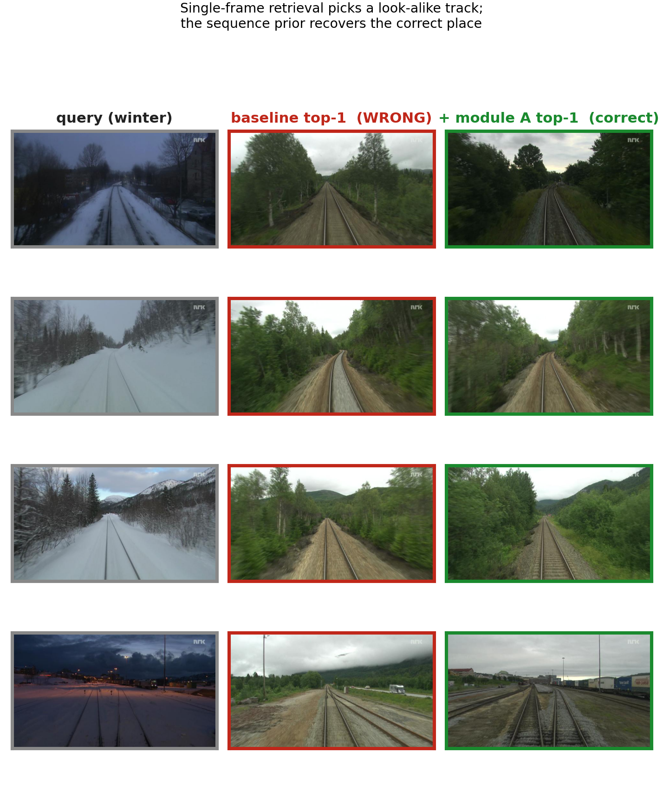
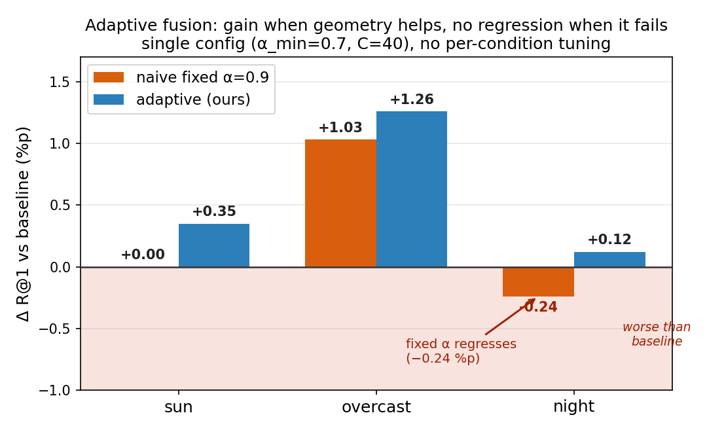
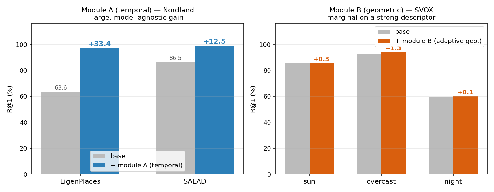

# Training-Free Temporal Filtering and Geometric Re-ranking for Visual Place Recognition

Classical, **learning-free** post-processing on top of **frozen** deep VPR descriptors.
A controlled empirical study of *when and why* two non-deep-learning cues — a temporal
(sequence) prior and a geometric verification step — improve Recall@K, and a small
no-regression contribution that makes the geometric step safe to use.

> **One-line takeaway:** Among training-free post-processing options, the most valuable
> signal is the **temporal (sequence) prior** (+12 to +33 R@1), while geometric
> verification is **marginal on a strong foundation descriptor** (+0 to +1.8 R@1) and
> can even *hurt* unless its weight is made confidence-adaptive.
>
> **Real-time angle:** the temporal prior also has a **causal online** form that is
> real-time (**0.46 ms/query**) yet reaches **98.76 R@1** on Nordland — see
> [`docs/REALTIME.md`](docs/REALTIME.md).

---

## 1. Motivation

Visual Place Recognition (VPR) is the core of **loop-closure detection** and
**relocalization** in robot navigation: as odometry (e.g. LiDAR-inertial / visual)
accumulates drift, recognizing a previously visited place is what bounds the error.

Modern deep global descriptors (EigenPlaces, SALAD/DINOv2) are strong, but a
**single-frame** retrieval still fails under extreme appearance change (seasons,
day/night) and repetitive structure. The question this project asks is deliberately
narrow and honest:

> *Without any additional training, how much can classical post-processing improve a
> frozen state-of-the-art descriptor — and which classical cue actually matters?*

This is **not a new SOTA method**. It is a controlled study of two well-known cues
(temporal consistency and geometric verification) applied as plug-in modules, plus a
simple confidence-adaptive fusion rule for the geometric cue.

## 2. Method overview

```
query sequence (consecutive frames) ─┐
                                      ├─> [frozen] deep VPR model ─> descriptors ─> cosine sim. matrix  S (T×N)
database traverse  ───────────────────┘
                                                                       │
                            ┌──────────────────────────────────────────┤
                            ▼                                          ▼
              [Module A] temporal consistency               [Module B] geometric re-ranking
              (SeqSLAM / Viterbi / forward filter)          (SIFT + ratio test + MAGSAC inliers)
                            │                                          │
                            └──────────────> score fusion <───────────┘
                                                  │
                                       final top-1 → Recall@1/5/10
```

- **Module A — Temporal consistency filtering** (the main result). The queries form a
  *driving sequence*, so the correct matches lie on a near-diagonal path in `S`. Three
  variants: SeqSLAM-style local-contrast normalization + constant-velocity diagonal
  windows; an offline **Viterbi** MAP path over an HMM; and an online **forward (Bayes)
  filter** for the real-time/causal case.
- **Module B — Geometric verification re-ranking.** For each query's top-K candidates,
  match SIFT keypoints (Lowe ratio test), fit a homography with **MAGSAC**, and use the
  inlier count as a geometric consistency score; fuse it with the global similarity.
- **Adaptive fusion (contribution).** A fixed fusion weight can *drop* R@1 when geometry
  is unreliable (e.g. at night). We set the weight per query from the geometric
  confidence, so the re-ranker only intervenes when the geometric signal is strong and
  otherwise falls back to the retrieval order — giving near **no-regression** behavior.

Full equations are in [`docs/METHOD.md`](docs/METHOD.md).

## 3. Datasets, models and protocol

| Component | Choice | Role |
|---|---|---|
| Descriptor (frozen) | **EigenPlaces** (ICCV 2023, ResNet50, 2048-d) | default backbone, loaded via `torch.hub` |
| Descriptor (frozen) | **SALAD** (CVPR 2024, DINOv2) | stronger descriptor, generality check |
| Sequence dataset | **Nordland** (winter query ↔ summer DB) | extreme seasonal change → Module A stage |
| Conditioned dataset | **SVOX** (sun / overcast / night queries) | appearance-conditioned → Module B stage |
| (excluded) | St Lucia | baseline R@1 = 99.5% (ceiling), no headroom |

- **Ground truth / Recall:** a retrieval is correct if a returned DB image lies within
  **25 m** (UTM) of the query, the standard threshold for driving datasets. The protocol
  is fixed in one place ([`src/datasets.py`](src/datasets.py)) and never changed between
  experiments.
- **Metrics:** Recall@1 / @5 / @10, plus per-query post-processing latency (ms).

## 4. Results

### 4.1 Headline



The temporal (sequence) cue dominates; the geometric cue is marginal on a strong
descriptor.

### 4.2 Module A — temporal filtering (Nordland)

| Model | base R@1 | + temporal (SeqSLAM, offline) | + temporal (forward, online) |
|---|---|---|---|
| EigenPlaces | 63.65 | **97.09**  (+33.44) | 91.76 |
| SALAD | 86.46 | **98.98**  (+12.52) | — |

Large, **model-agnostic** gains. The offline MAP path beats the causal online filter,
as expected.



**Why it works** — single-frame retrieval picks a look-alike track; the sequence prior
recovers the correct place:



### 4.3 Module B — geometric re-ranking (SVOX, EigenPlaces)

| Condition | base R@1 | best fixed-α re-rank | adaptive (ours) |
|---|---|---|---|
| sun | 85.25 | 85.48 (+0.23) | **85.60** |
| overcast | 92.55 | 94.38 (+1.83, best case) | 93.81 |
| night | 59.78 | 59.54 ⚠️ *(regresses)* | **59.90** |

Geometric verification only helps a little, and only when SIFT matching is feasible. With
a **single** fixed weight applied across conditions, the best choice still *regresses* at
night; the **adaptive** rule (single config, no per-condition tuning) improves every
condition with no regression.



### 4.4 Combined overview



Full numeric tables, latency, and the similarity-matrix view are in
[`docs/RESULTS.md`](docs/RESULTS.md) and [`results/results_summary.csv`](results/results_summary.csv).

### 4.5 Real-time analysis and why the learned descriptor matters

Motivated by robotics (online, within the camera frame budget), the temporal prior has a
**causal online** form that is real-time **and** the most accurate:

| method (Nordland, EigenPlaces) | R@1 | latency | real-time |
|---|---|---|---|
| single-frame (base) | 63.65 | 0.08 ms | yes |
| + temporal, offline (SeqSLAM) | 97.09 | 1.78 ms | no |
| **+ temporal, online (forward)** | **98.76** | **0.46 ms** | **yes** |


A **no-deep-learning** baseline isolates the descriptor's contribution: on the *same*
400-image task, pure geometric matching reaches only **30.75 R@1** vs **96.0** for the
frozen descriptor (+65 R@1), and geometric-only retrieval is orders of magnitude slower
(not real-time at scale). The same lesson explains why the classic SeqSLAM (raw-pixel base)
was limited on Nordland: post-processing only amplifies the signal the base already has.


A **fully-classical** alternative base (CLAHE + HOG, replacing SeqSLAM's raw-pixel SAD) was
also tested: with the temporal filter it reaches **96.1 R@1** in real time (no deep
learning at all), but the frozen deep descriptor still wins (98.8) and is far more robust
single-frame (63.65 vs 25.32) — i.e. HOG leans almost entirely on the sequence prior.


Details, latency budget, descriptor-training background, prior-work numbers and honest
caveats: [`docs/REALTIME.md`](docs/REALTIME.md),
[`results/realtime_summary.csv`](results/realtime_summary.csv),
[`results/no_dl_subset.csv`](results/no_dl_subset.csv),
[`results/classical_base.csv`](results/classical_base.csv).

## 5. Reproducing the experiments

> Hardware note: developed on an RTX 5070 Ti (Blackwell, `sm_120`), which requires a
> **CUDA 12.8** PyTorch build (`cu128`). Do not install pinned older torch versions from
> third-party `requirements.txt` files — they fail with "no kernel image" on Blackwell.

```bash
# 1) environment
python -m venv .venv && source .venv/bin/activate
pip install torch torchvision --index-url https://download.pytorch.org/whl/cu128
pip install -r requirements.txt

# 2) download datasets (third-party tool, see section 7) — datasets are NOT shipped in this repo
cd vpr-datasets-downloader
#   rsync -rhz rsync://vandaldata.polito.it/sf_xl/VPR-datasets-downloader/nordland datasets/
#   python download_svox.py
cd ..

# 3) sanity check: extract descriptors for one query folder
python src/extract_features.py \
    --images vpr-datasets-downloader/datasets/svox/images/test/queries_overcast \
    --out cache/q_overcast.npy --model eigenplaces

# 4) baseline + Module A (temporal) on Nordland
python src/run_experiment.py --dataset vpr-datasets-downloader/datasets/nordland --model eigenplaces
python src/run_experiment.py --dataset vpr-datasets-downloader/datasets/nordland --model eigenplaces \
    --module-a --ta-method seqslam

# 5) Module B (geometric) sweep on SVOX
python src/rerank_sweep.py --dataset vpr-datasets-downloader/datasets/svox \
    --db-subdir gallery --q-subdir queries_overcast --model eigenplaces

# 6) adaptive-fusion analysis + all figures
python src/gated_analysis.py
python src/make_figures.py && python src/make_qualitative.py && python src/make_slide_figures.py

# 7) real-time analysis + why-deep-learning baseline (see docs/REALTIME.md)
python src/eval_realtime.py                 # online vs offline temporal: R@1 + latency
SUBSET_M=400 STRIDE=20 python src/eval_no_dl.py    # geometric-only vs deep, same task
python src/eval_classical_base.py           # raw-pixel SAD vs CLAHE+HOG vs deep ladder
python src/make_realtime_figures.py
```

Every run appends one row to `results/results.csv` (config hash, metrics, latency).
Descriptors are extracted once and cached under `cache/` for reuse.

## 6. Repository layout

```
.
├── README.md
├── requirements.txt
├── docs/
│   ├── METHOD.md          # equations for Modules A, B and the adaptive fusion
│   ├── RESULTS.md         # full result tables, latency, analysis
│   └── REALTIME.md        # real-time (online) analysis + why-deep-learning baseline
├── src/
│   ├── extract_features.py   # frozen model loading → L2-normalized descriptors (.npy)
│   ├── eval_recall.py        # similarity matrix → Recall@K (shared interface)
│   ├── datasets.py           # UTM filename parser + 25 m positives (protocol fixed here)
│   ├── temporal_filter.py    # Module A: SeqSLAM / Viterbi / forward filter
│   ├── rerank_geometric.py   # Module B: SIFT + ratio test + MAGSAC inliers
│   ├── rerank_sweep.py       # offline α/K sweep over cached inliers
│   ├── gated_analysis.py     # adaptive confidence-weighted fusion (contribution)
│   ├── eval_realtime.py      # accuracy vs latency table (online vs offline temporal)
│   ├── eval_no_dl.py         # geometric-only vs frozen descriptor (why deep learning)
│   ├── eval_classical_base.py # raw-pixel SAD vs CLAHE+HOG vs deep (single/+SeqSLAM/+DTW)
│   ├── run_experiment.py     # one config → full pipeline → results.csv
│   └── make_*.py             # figure generation
├── results/
│   ├── results.csv           # append-only experiment log
│   ├── results_summary.csv   # curated headline numbers
│   ├── realtime_summary.csv  # online/offline temporal: R@1 + latency
│   ├── no_dl_subset.csv      # geometric-only vs deep (same task)
│   ├── classical_base.csv    # raw-pixel SAD vs CLAHE+HOG vs deep ladder
│   └── figures/              # all figures used above
└── vpr-datasets-downloader/  # third-party dataset tool (scripts only, see section 7)

# datasets are downloaded into vpr-datasets-downloader/datasets/ (git-ignored, not shipped)
```

## 7. Acknowledgements and third-party components

This project builds on existing models, datasets and tooling. None of the following are
my work; they are used as frozen / external components and credited here:

- **Frozen descriptors** (loaded at inference via `torch.hub`):
  - EigenPlaces — Berton et al., *ICCV 2023* — `gmberton/eigenplaces`
  - SALAD — Izquierdo & Civera, *CVPR 2024* — `serizba/salad`
- **Datasets:** Nordland (Sünderhauf et al.), SVOX (Berton et al.), St Lucia
  (Milford & Wyeth), prepared with the standardized downloader below.
- **`vpr-datasets-downloader/`** — a vendored copy of
  [gmberton/vpr-datasets-downloader](https://github.com/gmberton/vpr-datasets-downloader)
  (MIT). **Only the scripts are included** (the multi-GB downloaded datasets are not);
  it keeps its original `LICENSE` and `README.md`. It is used to download and format the
  datasets into the standardized `@`-separated UTM filename convention that
  [`src/datasets.py`](src/datasets.py) parses.

My contribution is the post-processing code under [`src/`](src/) and the empirical study.

## 8. References

- M. Milford and G. Wyeth, "SeqSLAM: Visual route-based navigation for sunny summer days and stormy winter nights," *ICRA*, 2012.
- G. Berton, C. Masone, B. Caputo, "EigenPlaces: Training viewpoint robust models for visual place recognition," *ICCV*, 2023.
- S. Izquierdo and J. Civera, "Optimal transport aggregation for visual place recognition (SALAD)," *CVPR*, 2024.
- S. Hausler et al., "Patch-NetVLAD: Multi-scale fusion of locally-global descriptors for place recognition," *CVPR*, 2021.
- D. Barath et al., "MAGSAC++, a fast, reliable and accurate robust estimator," *CVPR*, 2020.
- D. Lowe, "Distinctive image features from scale-invariant keypoints," *IJCV*, 2004.
- M. Fischler and R. Bolles, "Random sample consensus," *CACM*, 1981.
- R. Arandjelović et al., "NetVLAD: CNN architecture for weakly supervised place recognition," *CVPR*, 2016.
- N. Sünderhauf, P. Neubert, P. Protzel, "Are we there yet? Challenging SeqSLAM on a 3000 km journey across all four seasons," *ICRA Workshop*, 2013.
