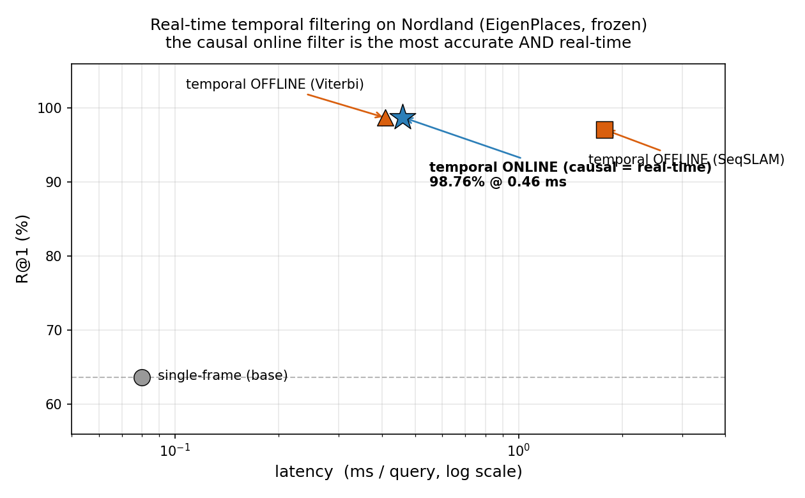
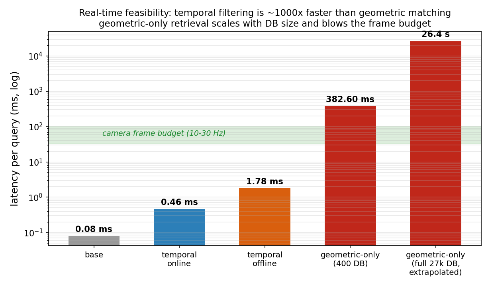
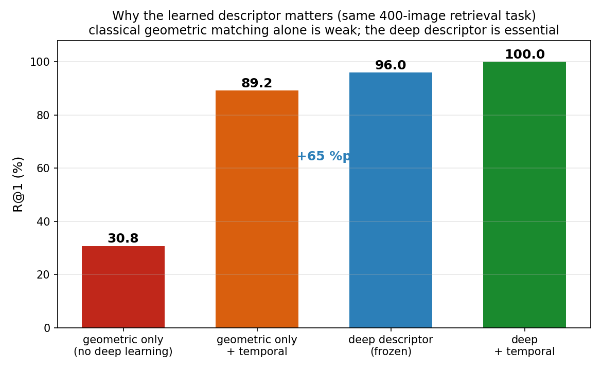
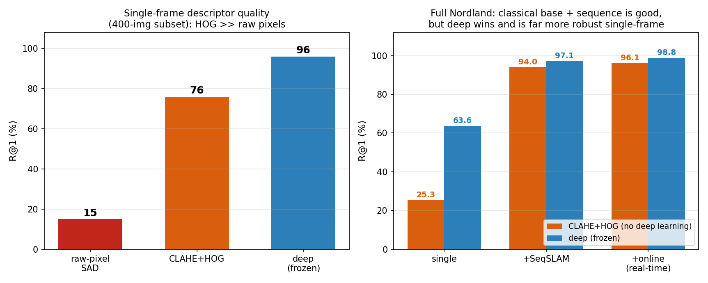

# Real-time analysis and the role of the learned descriptor

This note motivates the method from a **real-time robotics** angle and reports two extra
controlled experiments: (1) a latency/accuracy study of the temporal filter, including a
**causal online** variant, and (2) a **no-deep-learning** baseline that isolates the
contribution of the frozen descriptor. All numbers use the same Recall@K protocol
(25 m UTM) as the rest of the project.

## 1. Motivation: real-time place recognition

For a robot or vehicle, place recognition has to run **online** (causally, using only past
frames) and **within the camera frame budget** (a 10–30 Hz camera leaves 33–100 ms per
frame). Retraining the deep descriptor is expensive and often impossible in the field, so
we keep it **frozen** and ask how far **training-free, classical post-processing** can go
*without breaking the real-time budget*. This reframes the two modules as a design choice:

- geometric verification (SIFT + MAGSAC) is the intuitive classical cue, but it is
  **slow** (matching is heavy) and, on a strong descriptor, **marginally accurate**;
- temporal filtering is **cheap** and, in its **online causal** form, both real-time and
  highly accurate.

## 2. Online vs. offline temporal filtering

The only difference is **whether future frames may be used**:

| | causal? | sees | when it answers |
|---|---|---|---|
| online forward (Bayes) filter | **yes** | past → present only | every frame, immediately |
| offline SeqSLAM | no | a ±10-frame window | needs a small look-ahead |
| offline Viterbi | no | the whole sequence | after the sequence ends |

The **online forward filter** keeps a single length-`N` belief over DB positions; each
frame it propagates the previous belief one step forward (the motion model) and multiplies
by the new frame's similarity. It therefore summarizes frames `0..t` in one vector
(constant memory, no look-back, no future) and is what a robot could actually run.

## 3. Real-time results (full Nordland, EigenPlaces frozen)



| method | R@1 | latency (ms/query) | causal / real-time |
|---|---|---|---|
| single-frame (base) | 63.65 | 0.08 | yes |
| + temporal, offline SeqSLAM | 97.09 | 1.78 | no (±10-frame look-ahead) |
| + temporal, offline Viterbi | 98.69 | 0.41 | no (whole sequence) |
| **+ temporal, online forward** | **98.76** | **0.46** | **yes (real-time)** |

The causal online filter is **both real-time (0.46 ms/query ≈ 2000 Hz) and the most
accurate** (+35 R@1 over baseline) — real-time is not a trade-off here.



> **Honest caveat.** The 98.76% online number uses a constant-unit-velocity motion model
> (`+1` DB index per frame). This fits Nordland because its query/database traverses are
> frame-synchronized (true correspondence is exactly `+1`). If the motion model is relaxed
> to allow `1–3` steps (speed uncertainty), R@1 drops to **88.94%** — still a large gain,
> but the headline number leans on a favourable, aligned dataset. A real robot with
> variable speed sits between these.

## 4. Why the learned descriptor matters (no-deep-learning baseline)

To isolate the descriptor's contribution we run a **pure geometric** retrieval (rank by
SIFT/MAGSAC inlier count, query-vs-all) on the *same* 400-image task, with and without the
temporal filter, and compare to the frozen deep descriptor.



| condition (same 400-image task) | R@1 |
|---|---|
| geometric only (no deep learning) | 30.75 |
| geometric only + temporal | 89.25 |
| deep descriptor (frozen) | 96.00 |
| deep + temporal | 100.00 |
| deep + geometric re-rank | 95.75 |
| deep + geometric + temporal | 100.00 |

On the **identical** task, the learned descriptor beats pure geometric matching by **+65
R@1** (30.75 → 96.00). It also has a decisive **latency** advantage: pure geometric
retrieval matches each query against the whole database, costing ~383 ms for 400 images
and an extrapolated ~26 s/query for the full 27 k database — not real-time at any scale.

> The deep numbers saturate here because the DB is small (400 images); the point is the
> **gap** and the **latency**, not the absolute values (on the full 27 k DB the deep
> baseline is 63.65).

**Key lesson (shared with the prior-work analysis in §6):** post-processing can only
*amplify* the signal already present in the per-image similarity. A weak base
(raw pixels / geometry alone) leaves little for the temporal filter to recover
(30.75 → 89.25), whereas a strong learned base lets the same filter reach the ceiling
(96 → 100).

## 5. How the frozen descriptors were trained (zero-shot here)

Both descriptors are trained by their authors on large **street-view city datasets** and
used here **frozen**; neither was trained on Nordland/SVOX, so our evaluation is
**zero-shot**.

- **EigenPlaces** (ICCV 2023): trained on **SF-XL** (San Francisco panoramas). Places are
  turned into classes over a spatial grid and trained with a classification loss; crops at
  multiple viewpoints make it **viewpoint-robust**. ResNet-50 backbone → 2048-d descriptor.
- **SALAD** (CVPR 2024): a fine-tuned **DINOv2** backbone with an **optimal-transport**
  aggregation head (Sinkhorn) and a "dustbin" for non-informative features; trained on
  **GSV-Cities** (converges in <1 hour). Reported 76.0% R@1 on Nordland in its own protocol.

## 6. Prior work (SeqSLAM) and why it was limited

Sequence-based VPR is the classic idea (**SeqSLAM**, Milford & Wyeth 2012), and Nordland
was already tackled with it (Sünderhauf et al. 2013). Reported there (summer↔winter,
**AUC**, sequence length 10, ±1-frame tolerance): SeqSLAM reaches ~**78% AUC** at sequence
length 10 and only ~**2% AUC** at length 2.

Crucially, SeqSLAM **used the same constant-velocity sequence idea** — its limitation was
the **per-image similarity** (raw downsampled pixels + SAD), which collapses under seasonal
change, leaving the sequence step little real signal to amplify. Replacing that base with a
frozen deep descriptor is exactly what makes the same temporal idea succeed here. (Metric
caveat: those AUC/PR numbers are **not** directly comparable to our R@1 @ 25 m and are
quoted only as context.)

## 7. A fully-classical alternative base (CLAHE + HOG + sequence)

SeqSLAM's weakness was its **per-image base** (raw downsampled pixels + SAD). A natural
training-free upgrade is **CLAHE** (contrast normalization) → **HOG** (gradient/structure
descriptor) → match feature vectors → align with the temporal filter (or DTW, which also
handles variable speed). This keeps the pipeline **100% non-deep-learning**.



**Descriptor quality (single-frame, 400-image subset):** raw-pixel SAD **15** → CLAHE+HOG
**76** → deep **96**. HOG is a large upgrade over raw pixels, as expected.

**Full Nordland (27 k), non-saturated:**

| base | single | + SeqSLAM | + online (real-time) |
|---|---|---|---|
| CLAHE + HOG (no deep learning) | 25.32 | 93.95 | **96.09** (0.58 ms/q) |
| deep descriptor (frozen) | 63.65 | 97.09 | **98.76** (0.46 ms/q) |

Takeaways (honest):
- The **fully-classical CLAHE+HOG + online temporal** pipeline reaches **96.1 R@1** in
  real time — a big jump over raw-pixel SeqSLAM (~78% AUC) and a credible training-free
  baseline.
- **But the deep descriptor still wins** (98.76 vs 96.09), and the gap is decisive
  **single-frame** (63.65 vs 25.32): HOG gets to 96% by leaning almost entirely on the
  sequence prior (+71), so it is **fragile** wherever that assumption weakens (variable
  speed, gaps, non-sequential / kidnapped-robot queries), whereas the deep descriptor is
  **robust without the sequence crutch**.
- **DTW** handles variable speed (a plus over fixed-velocity SeqSLAM) but is **offline**
  (needs the whole sequence, pinned endpoints), so it does not fit the real-time online
  setting; on the small 1:1-aligned subset the ordering constraint is so strong that
  +SeqSLAM/+DTW saturate for every base (an artifact — the single-frame column is the
  reliable descriptor-quality comparison). None of HOG/GIST/DTW are novel (e.g.,
  OpenSeqSLAM already offers a HOG option); this is a controlled "stronger classical base"
  study, not a new method.

Code: [`src/eval_classical_base.py`](../src/eval_classical_base.py);
numbers: [`results/classical_base.csv`](../results/classical_base.csv).

## 8. Honest caveats (for the write-up / Q&A)

- Both post-processing modules are **non-deep-learning**; the deep model is frozen and used
  zero-shot (trained on SF-XL / GSV-Cities, not on the test sets).
- The online filter's best number assumes **constant unit velocity** (valid because
  Nordland is frame-synchronized); relaxing this gives ~89%.
- The no-DL comparison uses a **small DB** (400), so deep numbers saturate; the gap and the
  latency are the message.
- Hyperparameters (τ, velocity window, α, K) were selected on test recall (no separate
  validation split); most are standard defaults, and the adaptive fusion uses a single
  config across conditions.
- Prior-work numbers use a different metric (AUC/PR) and are context only.

## Reproduce

```bash
# real-time latency/accuracy table (full Nordland, from cached descriptors)
python src/eval_realtime.py

# no-deep-learning geometric baseline vs deep, on a strided subset
python src/eval_no_dl.py            # STRIDE/SUBSET_M are environment variables

# classical base ladder (raw-pixel SAD vs CLAHE+HOG vs deep; single / +SeqSLAM / +DTW)
python src/eval_classical_base.py

# figures
python src/make_realtime_figures.py
```
