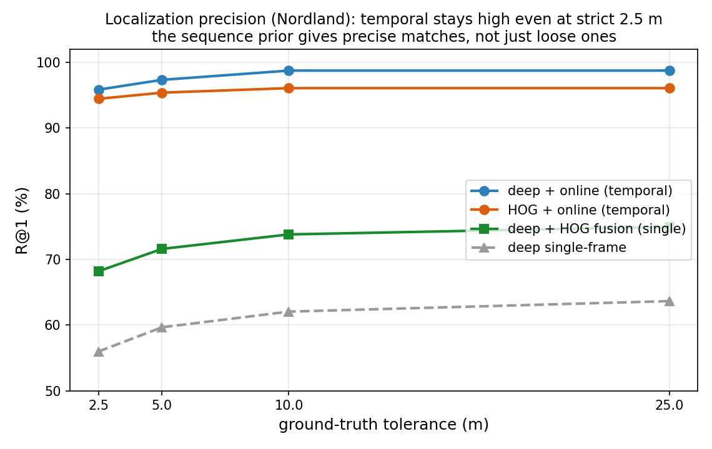
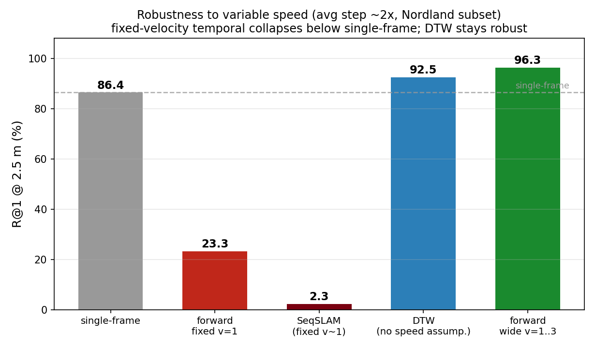
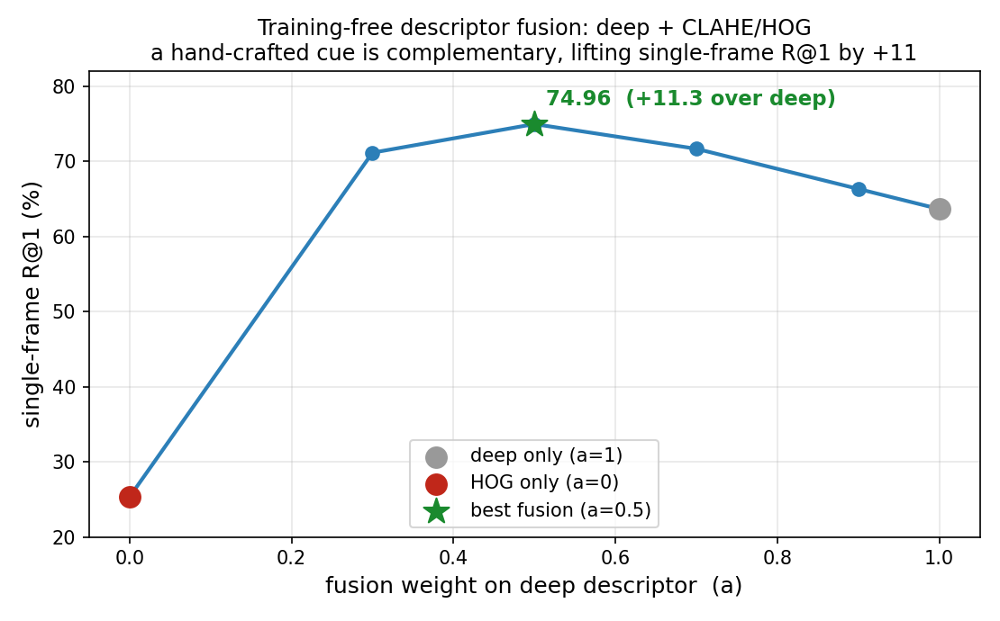

# Report guide — Training-Free Post-Processing for Visual Place Recognition

This document is the writing skeleton for the final report. It follows the presentation
flow, collects every number/figure, and flags the honest caveats. All results use the same
evaluation protocol (Recall@K at a UTM distance threshold, default 25 m) unless stated.

Figures live in [`../results/figures/`](../results/figures/); numeric tables in
[`../results/`](../results/).

---

## 1. Introduction

- **Visual Place Recognition (VPR)** = recognizing a previously visited place from an image.
  It is the core of **loop-closure** and **relocalization** in SLAM: odometry (LiDAR /
  visual) drifts over time, and recognizing "I have been here" bounds that drift.
- Applications: autonomous driving in GPS-denied areas, SLAM loop closure, AR/VR device
  wake-up relocalization.
- **Key property we exploit:** a moving robot produces a *continuous image stream*, not
  isolated photos. The query is a **sequence**, so the correct matches must evolve smoothly
  along the database traverse. This motivates a sequence (temporal) prior.

## 2. Problem & Dataset

- **Dataset — Nordland** (same railway filmed across seasons, winter ↔ summer). Chosen
  because it is the **hardest appearance-change** case (snow vs. greenery), so single-frame
  retrieval clearly fails — giving headroom to study post-processing. 27 k images, UTM
  ground truth, query/DB are ordered traverses (a true sequence).
- **Backbone — EigenPlaces** (ICCV 2023), a current strong VPR descriptor, used **frozen**.
  It is trained on **city street-view (SF-XL)**, so it is **out-of-domain** for Nordland's
  seasonal railway scenes.
- **Single-frame limitation:** EigenPlaces single-frame **R@1 = 63.65%** on Nordland —
  ~1 in 3 queries wrong. *A single frame is not enough; an extra cue is needed.*

## 3. Related Work — SeqSLAM

- **SeqSLAM** (Milford & Wyeth, ICRA 2012): if the query is a sequence, the correct matches
  form a near-diagonal in the similarity matrix; impose a **constant-velocity diagonal
  prior**. The classic sequence-based VPR method.
- **But the base was weak:** SeqSLAM's per-frame similarity was **raw-pixel SAD**
  (downsampled grayscale absolute differences), which collapses under seasonal/illumination
  change. On Nordland (Sünderhauf et al., 2013) it stalls around **~78% AUC**.
- **Our reading:** SeqSLAM's limitation was **not** the sequence idea but the **weak base**.
  → research question below.

## 4. Method — Replace the Weak Base, Keep the Sequence

**Research question:** *How far does the sequence prior go on top of a stronger,
still-classical base?*

**Proposed classical pipeline (100% non-deep-learning):**
```
raw image (winter/summer) → CLAHE (illumination norm.) → HOG (gradient features)
   → cosine similarity matrix S (T×N) → DTW (sequence alignment)
```
The same sequence step is applied on **three bases**: raw-pixel SAD (SeqSLAM 2012) ·
**CLAHE+HOG (ours, classical)** · frozen deep (EigenPlaces).

**Temporal aligners** ([`../src/temporal_filter.py`](../src/temporal_filter.py)): SeqSLAM
diagonal rescoring, an offline Viterbi MAP path, and a causal **online forward (Bayes)
filter** for the real-time case.

**Why DTW (robustness).** SeqSLAM/forward filters assume a (near-)constant velocity; a real
robot changes speed (stops, slows). **DTW** ([`../src/eval_dtw_robustness.py`](../src/eval_dtw_robustness.py))
aligns the two sequences with a monotonic *time warp* and assumes **no fixed speed**, so it
is robust to speed variation (§5.3).

**Evaluation protocol.** A retrieval is correct if a returned DB image lies within a UTM
distance threshold of the query. We use the standard **25 m** and also report a strict
**2.5 m** to probe localization *precision* ([`../src/datasets.py`](../src/datasets.py)).

## 5. Experiments & Results

### 5.1 Stronger base → higher ceiling (Nordland)

| base | single-frame R@1 | + sequence | Δ | deep-learning? |
|---|---|---|---|---|
| raw-pixel SAD (SeqSLAM 2012) | very weak | ~78% AUC | — | No |
| **CLAHE + HOG (ours)** | 25.32 | **96.10** | **+70.78** | No |
| frozen deep (EigenPlaces) | 63.65 | **98.80** | +35.15 | Yes |


- **Hypothesis validated:** changing only the base lifts the sequence result by +70.8 R@1 —
  the weak part was the base, not the sequence.
- **No-DL is enough for a real-time baseline:** CLAHE+HOG + sequence = 96.1 R@1.
- **But deep still wins** and is far more robust single-frame (63.65 vs 25.32).
- Source: [`results/classical_base.csv`](../results/classical_base.csv) (single-frame is the
  reliable column; small aligned subsets saturate the sequence/DTW columns).

### 5.2 Localization precision — ground-truth tolerance (25 m vs 2.5 m)



| method | 2.5 m | 5 m | 10 m | 25 m |
|---|---|---|---|---|
| deep single-frame | 55.98 | 59.66 | 62.05 | 63.65 |
| deep + online (temporal) | **95.86** | 97.35 | 98.76 | 98.76 |
| HOG + online (temporal) | 94.46 | 95.40 | 96.09 | 96.09 |
| deep + HOG fusion (single) | 68.20 | 71.60 | 73.81 | 74.96 |

The temporal result stays **~96% even at a strict 2.5 m** → the sequence prior produces
**precise** matches, not just coarse ones. Source:
[`results/threshold_sensitivity.csv`](../results/threshold_sensitivity.csv).

### 5.3 Robustness to variable speed — why DTW

Queries resampled at irregular steps (avg ~2× speed), R@1 at strict **2.5 m**:



| aligner | R@1 @ 2.5 m | R@1 @ 25 m |
|---|---|---|
| single-frame (reference) | 86.40 | 93.40 |
| forward, fixed v=1 | 23.27 | 92.39 |
| SeqSLAM (fixed velocity ~1) | 2.27 | 4.25 |
| **DTW (no speed assumption)** | **92.51** | 100.0 |
| forward, wide v=1..3 | 96.28 | 100.0 |

Fixed-velocity temporal methods **collapse below single-frame** when the speed differs from
their assumption; **DTW stays robust** (and widening the motion model also works, but needs
the speed range). Source: [`results/dtw_robustness.csv`](../results/dtw_robustness.csv).

### 5.4 Real-time feasibility

| method (Nordland) | R@1 | latency | real-time |
|---|---|---|---|
| single-frame (base) | 63.65 | 0.08 ms | yes |
| + temporal, offline SeqSLAM | 97.09 | 1.78 ms | no |
| **+ temporal, online forward** | **98.76** | **0.46 ms** | **yes** |

The causal online filter is real-time (~2000 Hz) and the most accurate. See
[`REALTIME.md`](REALTIME.md), [`results/realtime_summary.csv`](../results/realtime_summary.csv).

### 5.5 Contribution — Deep + HOG fusion at single-frame

Where the sequence cannot help (relocalization / single shots), fuse the classical HOG cue
**into** the deep descriptor (score-level, training-free):



**Single-frame R@1: 63.65 → 74.96 (+11.3)** at fusion weight a = 0.5. Deep captures learned
semantic invariance, HOG captures explicit gradient structure → **complementary cues**.
Source: [`results/deep_hog_fusion.csv`](../results/deep_hog_fusion.csv).

## 6. Discussion

- The **sequence prior is the dominant training-free signal** on continuous data; its effect
  scales with the **base quality** (raw-pixel ≪ HOG ≪ deep), which both explains SeqSLAM's
  historical limitation and motivates a stronger base.
- DTW adds **speed robustness** the fixed-velocity filters lack — important for real robots.
- A **purely classical** pipeline (CLAHE+HOG+sequence) is a credible real-time baseline
  (96.1 R@1), but the **learned descriptor remains essential** for single-frame robustness,
  which is exactly what matters when the sequence assumption breaks.
- The classical HOG cue is best used **fused into** the deep descriptor, improving the
  single-frame (relocalization) regime by +11.3.

## 7. Conclusion & Honest Limitations

**Findings.** (1) Base quality determines the sequence ceiling — SeqSLAM's 2012 weakness was
the raw-pixel base. (2) A classical base reaches 96% (no DL, real-time). (3) Classical + deep
are complementary (deep+HOG fusion, +11.3 single-frame).

**Limitations (state in the report).**
- **Frame-sync dependency:** Nordland's query/DB are frame-synchronized, so the constant-unit
  motion model fits well; the headline 98.76 leans on this (relaxed motion model → ~89%, and
  the variable-speed study in §5.3 quantifies the brittleness of fixed-velocity methods).
- **Hyperparameters tuned on test** (no separate validation split); cross-dataset validation
  is future work.
- **Single dataset for fusion:** the deep+HOG fusion gain is shown on Nordland only;
  generalization needs more datasets.
- **Metric caveat:** SeqSLAM's ~78% AUC (PR-curve) is not directly comparable to our
  R@1 @ 25 m and is quoted as context only.

## References

- Milford & Wyeth, "SeqSLAM…," ICRA 2012.
- Sünderhauf et al., "Are we there yet? Challenging SeqSLAM…," ICRA Workshop 2013.
- Berton et al., "EigenPlaces…," ICCV 2023.
- Izquierdo & Civera, "Optimal Transport Aggregation for VPR (SALAD)," CVPR 2024.
- Dalal & Triggs, "Histograms of Oriented Gradients…," CVPR 2005.
- Zuiderveld, "Contrast Limited Adaptive Histogram Equalization," Graphics Gems IV, 1994.
- Sakoe & Chiba, "Dynamic programming algorithm optimization for spoken word recognition," 1978.

## Figure index (which figure for which section)

| figure | section |
|---|---|
| `qualitative_nordland.png` | §1/§2 (why single-frame fails: look-alike tracks) |
| `nordland_heatmap.png` | §3/§4 (similarity matrix, diagonal structure) |
| `fig_classical_base.png` | §5.1 (base ladder) |
| `fig_threshold_sensitivity.png` | §5.2 (precision) |
| `fig_dtw_robustness.png` | §5.3 (why DTW) |
| `fig_realtime_accuracy_vs_latency.png`, `fig_latency_budget.png` | §5.4 (real-time) |
| `fig_descriptor_fusion.png` | §5.5 (deep+HOG fusion) |
