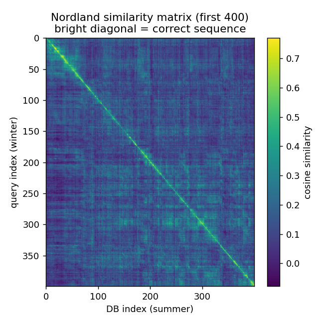
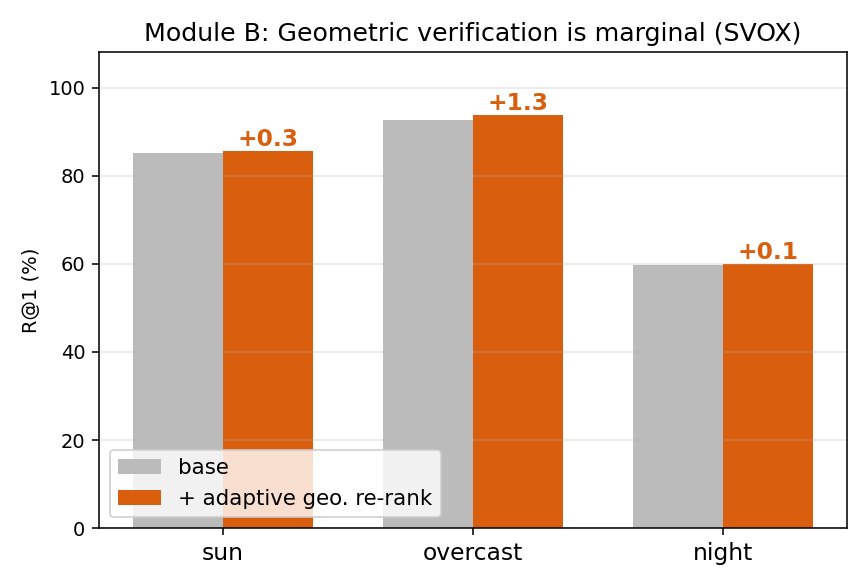

# 약한 base를 교체하고 시퀀스를 살린다 — 학습-프리 후처리를 통한 시각 장소 인식 개선

**Training-Free Post-Processing for Visual Place Recognition: Replace the Weak Base, Keep the Sequence**

장은혁 (Eunhyeog Jang) · 서울대학교 · 컴퓨터 비전의 기초 2026 Final Project
GitHub: github.com/jangeunhyeog/CV_FINAL_PROJECT

> 모든 수치는 `results/` 의 CSV와 `src/` 의 평가 코드로 재현된다(헤드라인 채점은 `R@1 @ 25 m UTM`).
> 정답 판정 프로토콜은 `src/datasets.py` 한 곳에 고정되어 실험 간 변하지 않는다.

---

## 1. 서론 (Background & Problem)

**시각 장소 인식(Visual Place Recognition, VPR)** 은 쿼리 이미지가 어느 장소에서 촬영되었는지를
데이터베이스(DB) 검색으로 알아내는 문제다. 이동 로봇의 **위치추정(localization)** 에서 odometry·
SLAM은 연속적인 자세를 추정하지만 시간이 지날수록 **누적 오차(drift)** 가 쌓인다. VPR이 *"여기는
예전에 와본 곳"* 이라고 답해 주면 **loop closure**·**relocalization(kidnapped robot)** 을 통해 그
drift를 **bound** 할 수 있다. 자율주행 GPS 음영 구간, SLAM loop closure, AR/VR 기기 재시작 후
재위치 추정이 대표적 응용이다.

최근 VPR은 NetVLAD → CosPlace/MixVPR을 거쳐, 시점에 강건한 **EigenPlaces**(ICCV 2023)와 DINOv2
기반 **SALAD**(CVPR 2024) 같은 **foundation descriptor** 로 발전했다. 그러나 이들은 본질적으로
**단일 프레임(single-frame) 검색** 이라, **극단적 외관 변화**(계절·낮밤)나 반복 구조에 의한
**지각적 혼동(perceptual aliasing)** 앞에서 무너진다.

> **출발점(동기).** 본 연구는 원래 LiDAR-inertial odometry(FAST-LIO2)의 퇴화(degeneracy) 환경
> 강건성 문제에서 출발했으나, 시각 단서로 LiDAR point를 재가중하는 방식이 추정기의 관측 불가능성을
> 해소하지 못하고 멀티센서 GT 확보 부담이 크다는 분석에 따라, **동일한 문제의식(주행 로봇의 강건한
> 위치 인식)** 을 유지하면서 odometry drift를 실제로 보정하는 **카메라 기반 VPR** 로 범위를 조정했다.

**단일 프레임의 한계 — 정량적 근거.** SOTA descriptor EigenPlaces조차 계절이 정반대인 Nordland
(겨울 쿼리 ↔ 여름 DB, 27k DB)에서 **단일 프레임 R@1 = 63.65%** 에 그친다. 도시(주행) 데이터로
학습된 descriptor가 계절 변화라는 도메인 밖 외관 변화에 약하기 때문이다. → **단일 프레임만으로는
한계가 있고, 추가 신호가 필요하다.**


## 2. 연구 질문 (Research Question)

> **추가 학습이나 데이터 없이, 동결된(frozen) 최신 descriptor에 고전(비딥러닝) 후처리만 더했을 때
> Recall을 얼마나 끌어올릴 수 있는가? 그리고 그 이득의 원천은 무엇인가 — base 품질인가, 시퀀스
> prior인가, 두 단서(시간/기하)는 각각 어떤 실패 모드에 듣는가?**

과제 유형은 *기존 방법에 비딥러닝 전/후처리 구성요소를 추가* 하는 것이다. 동결된 모델로
쿼리·DB cosine 유사도 행렬 **S ∈ ℝ^{T×N}** 를 얻은 뒤, 그 위에서만 후처리를 적용한다(학습 0).

## 3. 데이터셋 · 모델 · 평가 프로토콜

| 구분 | 선택 | 역할 |
|---|---|---|
| Descriptor (frozen) | **EigenPlaces** (ResNet50, 2048-d) | 기본 backbone |
| Descriptor (frozen) | **SALAD** (DINOv2, 8448-d) | 더 강한 descriptor, 일반성 확인 |
| 시퀀스 데이터셋 | **Nordland** (winter ↔ summer, 27,592장) | 극단적 계절 변화 → 시간 단서 무대 |
| 조건부 데이터셋 | **SVOX** (sun/overcast/night 쿼리) | 외관 조건별 → 기하 단서 무대 |
| (제외) | St Lucia | base R@1 = 99.5% (ceiling, headroom 없음) |
| (제외) | Baidu | 공개 라벨의 좌표계 불일치 |

**동결 descriptor는 zero-shot(왜 Nordland에서 약한가).** 두 descriptor 모두 저자들이 **도시
스트리트뷰** 로 학습한 모델을 **동결** 해 그대로 쓴다 — Nordland/SVOX로는 학습하지 않았으므로 본
평가는 **zero-shot** 이다. **EigenPlaces**(ICCV 2023)는 **SF-XL**(샌프란시스코 파노라마)에서 공간
격자 분류 손실로 학습돼 시점에 강건하다(ResNet50 → 2048-d). **SALAD**(CVPR 2024)는 **DINOv2** 를
**GSV-Cities** 로 미세조정하고 optimal-transport(Sinkhorn) 집계 헤드를 얹는다. 즉 SOTA지만 **도시
기반** 이라, 계절이 정반대인 시골 철도(Nordland)라는 도메인 밖에서 단일 프레임이 무너지는 것이다.

**정답 판정(채점).** 검색 결과가 쿼리의 UTM 좌표 기준 **25 m** 이내 DB를 반환하면 정답으로 본다
(주행 데이터셋 표준 `R@1 @ 25 m`). 프로토콜은 `src/datasets.py` 한 곳에 고정한다. 지표는
Recall@{1,5,10} 과 쿼리당 후처리 latency(ms).

**Nordland의 프레임 간격과 25 m의 의미(중요).** Nordland는 겨울/여름이 **프레임 단위로 동기화**
되어 query[i] ↔ db[i] 가 같은 위치다. 파일명 UTM 좌표로 직접 계산하면 **연속 프레임 간 거리 ≈
2.4 m(등간격 리샘플)** 이다. 따라서 25 m 임계값은 사실상 **±10 프레임(쿼리당 정답 21장)** 에 해당한다.
이 민감도는 §6.7에서 엄격 기준(±1 프레임)과 함께 정량 분석한다.



위 유사도 행렬 heatmap은 밝은 **대각선**(정답 시퀀스)과 강한 **off-diagonal 노이즈**(혼동)를 함께
보여, 단일 프레임 검색의 한계와 시간 필터링의 여지를 동시에 시각화한다.

## 4. 배경 — SeqSLAM (Milford & Wyeth, ICRA 2012)

**핵심 아이디어.** 쿼리가 연속 시퀀스라면, 정답 매칭도 DB 인덱스를 따라 **대각선으로 정렬** 되어야
자연스럽다. SeqSLAM은 유사도 행렬 위에 **등속(constant-velocity) 대각선 prior** 를 부과한다.

**그러나 base가 약했다.** SeqSLAM의 per-frame 유사도는 **raw-pixel SAD**(다운샘플 grayscale
픽셀 절댓값 차이 합)였다. 계절·낮밤 변화 앞에서는 같은 장소라도 픽셀값이 완전히 달라져 무너진다
(Nordland 2013 후속 연구에서 ~78% AUC에 머무름). → **본 연구의 가설: 약했던 것은 시퀀스 발상이
아니라 base다. base만 더 강한 고전 descriptor로 바꾸면 같은 시퀀스 위에서 어디까지 갈까?**

## 5. 방법 (Method)

### 5.1 모듈 A — 시간 일관성 필터링 (HMM)

쿼리가 주행 시퀀스라는 사실을 활용한다. 상태 x_t = DB 인덱스, 관측 z_t = 쿼리 descriptor.
- **Emission**: p(z_t | x_t=j) ∝ exp(s_{tj}/τ)
- **Transition**: 인덱스가 [v_min, v_max] 만큼 전진(+ 작은 teleport 확률 ε)

세 가지 추론 변형을 구현·비교한다.
1. **SeqSLAM** — 국소 대비 정규화 후 등속 대각선 윈도 합산(오프라인·양방향).
2. **Viterbi MAP** — 로그공간 DP 경로 δ_t(j)=max_i[δ_{t-1}(i)+log a_{ij}]+log b_t(j) (오프라인).
3. **Forward filter** — 인과적 belief 전파(온라인, 실시간 로봇 적용 가능).

### 5.2 base 사다리 — 약한 base 교체 (Replace the Weak Base)

SeqSLAM의 raw-pixel base를 **더 나은 고전 descriptor** 로 교체한다. 제안 고전 파이프라인:

`Raw image → CLAHE(조도 정규화) → HOG(gradient 구조) → cosine sim S → 시퀀스 정렬`

동일한 시퀀스 단계를 세 base에서 비교한다: **raw-pixel SAD**(SeqSLAM 2012) · **CLAHE+HOG(ours)** ·
**Frozen Deep(EigenPlaces)**. CLAHE는 조도/대비를 정규화하고, HOG는 픽셀값 대신 **gradient 구조**
를 보므로 계절 변화에 픽셀 SAD보다 강건하다.

**DTW 교차검증(강건성).** 시퀀스 정렬 방법 자체에 결과가 의존하지 않음을 보이기 위해, SeqSLAM
외에 **표준 동적시간왜곡(DTW)** — 비용 = −유사도의 최소 단조 경로(변속 허용) — 으로도 정렬해
교차검증한다(`src/eval_classical_base.py`). 즉 "시퀀스가 base 품질을 끌어올린다"는 결론이 특정
정렬기(SeqSLAM)에 종속되지 않음을 DTW로 확인한다.

### 5.3 Deep + HOG 융합 (단일 프레임 보강)

HOG는 단일 프레임 R@1이 25.32%로 낮지만, deep descriptor와 **상호 보완적** 일 수 있다(deep =
학습된 의미적 invariance, HOG = 명시적 gradient 구조). 시퀀스가 없는 **relocalization**(로봇 재부팅,
AR/VR wake) 시나리오를 위해, 점수 수준 융합 `score = a·deep + (1−a)·HOG` 를 학습 없이 적용한다.

### 5.4 모듈 B — 기하 검증 재정렬 + 신뢰도 적응형 융합

쿼리별 top-K 후보에 대해 **SIFT** 대응점을 Lowe ratio test(0.8)로 추출하고 **MAGSAC** 로 검증해
**inlier 수** 를 기하 일관성 점수로 쓴다. 전역 유사도와 선형 융합:
`final = α·norm(global) + (1−α)·norm(inliers)`.

**문제 → 해결(작은 알고리즘 기여).** 고정 α는 조건마다 최적값이 달라, 어떤 단일 α도 한 조건을
희생한다(야간엔 낮은 α가 파국적). 이에 **학습 없는 per-query 신뢰도 적응형 융합** 을 제안한다:
`conf_q = clip(max_inlier_q / C, 0, 1)`, `α_q = 1 − (1−α_min)·conf_q`. inlier가 많으면
geometry를 신뢰(α_q↓), 매칭이 실패하면 전역 검색 순서로 안전하게 후퇴(α_q→1)한다. 단일 (α_min, C)를
모든 조건에 공통 적용한다.

## 6. 실험 및 결과 (Results)

### 6.1 base 사다리 — 강한 base → 높은 천장 (Stronger Base → Higher Ceiling)

**Nordland R@1 (full 27k, 같은 시퀀스 단계, base만 변경):**

| Base | 단일 프레임 | + 시퀀스 | Δ | DL? |
|---|---|---|---|---|
| Raw-pixel SAD (SeqSLAM 2012) | very weak | ~78% AUC | — | No |
| **CLAHE + HOG (ours)** | 25.32 | **96.09** | +70.8 | **No** |
| Frozen Deep (EigenPlaces) | 63.65 | **98.76** | +35.1 | Yes |


- **가설 검증**: base만 바꿔도 시퀀스 위에서 +70.8 R@1. 약했던 건 시퀀스 발상이 아니라 **base** 였다.
- **No-DL로도 충분**: CLAHE+HOG + 시퀀스 = **96.1 R@1**, 실시간(0.58 ms/q). edge 환경 가능.
- **그래도 deep이 이긴다**: 단일 프레임 63.65 vs 25.32 — deep의 robustness는 압도적이고 천장도 높다(98.76).


### 6.2 모듈 A — 시간 필터링은 descriptor에 무관하게 큰 이득

| 모델 | base R@1 | + SeqSLAM(offline) | + online forward(real-time) |
|---|---|---|---|
| EigenPlaces | 63.65 | **97.09** (+33.4) | **98.76** (0.46 ms/q) |
| SALAD | 86.46 | **98.98** (+12.5) | — |


시간 필터링의 이득은 **모델에 무관** 하다(ResNet50 기반 EigenPlaces, DINOv2 기반 SALAD 모두). Nordland는
단일 프레임이 무너지지만(낮은 baseline → 큰 headroom) 시퀀스 구조는 보존되므로 이 모듈의 최적 무대다.

### 6.3 DTW — 시퀀스 이득은 정렬기에 종속되지 않음 (강건성)

**subset-400 (1:1 정렬), R@1:**

| Base | 단일 | + SeqSLAM | + DTW |
|---|---|---|---|
| raw-pixel SAD | 15.0 | 97.5 | 100.0 |
| CLAHE+HOG | 76.0 | 100.0 | 94.0 |
| deep (frozen) | 96.0 | 100.0 | 99.5 |

작은 1:1 정렬 부분집합에서는 순서 제약이 강해 +시퀀스/+DTW 열이 포화하므로 **단일 프레임 열이
descriptor 품질의 신뢰 가능한 비교** 다. 핵심은 SeqSLAM이든 DTW든 **시퀀스 정렬을 더하면 약한 base도
끌어올린다** 는 결론이 정렬기 선택에 종속되지 않음을 DTW가 교차 확인한다는 점이다.

### 6.4 Deep + HOG 융합 — 단일 프레임 보강

**Nordland 단일 프레임 R@1 (relocalization 시나리오):**

| deep 가중 a | 1.0 (deep) | 0.7 | **0.5 (best)** | 0.3 | 0.0 (HOG) |
|---|---|---|---|---|---|
| R@1 | 63.65 | 71.67 | **74.96** | 71.15 | 25.32 |


단일 프레임에서 **63.65 → 74.96 (+11.3)**, 학습 없이 단일 설정. deep과 HOG가 서로 다른 정보(의미적
invariance vs gradient 구조)를 잡아 **상호 보완** 하기 때문이다. 시퀀스가 없는 **relocalization** 에서
유효하다(시퀀스가 있으면 둘 다 ~97–99%로 포화하므로 융합의 가치는 단일 프레임 수준에 있다).

### 6.5 모듈 B — 기하 재정렬 + 적응형 융합 (SVOX)

| 조건 | baseline | 고정 α(단일 최선 0.9) | **적응형(제안)** |
|---|---|---|---|
| sun | 85.25 | 85.25 | **85.60** |
| overcast | 92.55 | 93.58 | **93.81** |
| night | 59.78 | 59.54 ⚠️하락 | **59.90** |
| 평균 | 79.19 | 79.45 | **79.77** |




기하 재정렬은 SIFT 매칭이 가능한 외관(sun/overcast)에서만 소폭~한계 개선(overcast +1.8이 최대)을
주고, night처럼 외관이 극단적이면 매칭 실패로 무력하다. 또한 **어떤 고정 α도 야간에서 baseline 아래로
하락** 한다. 제안한 **적응형 융합** 은 단일 설정으로 세 조건 모두 개선하며 **무하락** 이다(핵심은 큰
이득이 아니라 **robustness**).

### 6.6 실시간성 — 온라인 vs 오프라인 시간 필터 (full Nordland, EigenPlaces)

로봇/차량은 장소 인식을 **인과적(causal·과거 프레임만)** 으로, 그리고 **카메라 프레임 예산(10–30 Hz →
33–100 ms)** 안에서 돌려야 한다. 세 시간 필터 변형을 정확도·지연으로 비교한다.

| method | R@1 | latency (ms/q) | 인과적/실시간 |
|---|---|---|---|
| single-frame (base) | 63.65 | 0.08 | yes |
| + 시간 (offline SeqSLAM, ±10프레임 look-ahead) | 97.09 | 1.78 | no |
| + 시간 (offline Viterbi, 전체 시퀀스 MAP) | 98.69 | 0.41 | no |
| **+ 시간 (online forward, 인과적)** | **98.76** | **0.46** | **yes (real-time)** |


**인과적 online forward filter** 가 실시간(0.46 ms/q ≈ 2000 Hz)이면서 가장 정확하다(98.76) — 여기서
실시간은 trade-off가 아니다. forward filter는 길이-N belief 하나를 유지하며 매 프레임 모션 모델로 한
칸 전진 후 새 유사도를 곱한다(상수 메모리, look-back/future 없음). 반면 기하 재정렬은 두 자릿수 ms로
두 배수 이상 비싸고 이득은 한계적이라, **신뢰도 게이팅된 tie-breaker** 로만 쓰는 것이 합리적이다.

> **정직한 caveat.** online 98.76은 **등속(+1 인덱스/프레임)** 모션 모델 가정이며, Nordland가
> 프레임 동기화돼 있어 정확히 맞는다. 속도 불확실성을 허용(1–3칸)하면 **88.94** 로 떨어진다 — 여전히
> 큰 이득이지만 헤드라인 수치는 정렬된 데이터셋 덕을 본다. 가변속 실로봇은 둘 사이에 위치한다.

### 6.7 왜 딥러닝인가 — no-deep-learning 베이스라인

동결 descriptor의 기여를 분리하려고, **순수 기하 검색**(SIFT/MAGSAC inlier 수로 query-vs-all 랭킹,
딥러닝 0)을 같은 400장 과제에서 시간 필터 유무로 비교한다.

| 조건 (동일 400장 과제) | R@1 |
|---|---|
| geometric only (no deep learning) | 30.75 |
| geometric only + 시간 | 89.25 |
| deep descriptor (frozen) | 96.00 |
| deep + 시간 | 100.00 |
| deep + 기하 재정렬 | 95.75 |
| deep + 기하 + 시간 | 100.00 |


동일 과제에서 학습된 descriptor가 순수 기하 매칭을 **+65 R@1**(30.75→96.00) 앞서고, **지연** 도
결정적이다 — 순수 기하는 쿼리마다 DB 전체와 매칭해 400장에 ~383 ms, 전체 27k엔 ~26 s/q로 어떤
규모에서도 실시간 불가. (deep 수치가 100에 포화하는 건 DB가 400장으로 작기 때문 — 요점은 절대값이
아니라 **격차와 지연**. 전체 27k에선 deep base가 63.65.)

> **핵심 교훈.** 후처리는 per-image 유사도에 이미 존재하는 신호를 **증폭** 할 뿐 **생성** 하지 못한다.
> 약한 base(원본 픽셀/기하 단독)는 시간 필터가 복원할 게 별로 없고(30.75→89.25), 강한 학습 base는
> 같은 필터로 천장에 도달한다(96→100). 이것이 §6.1 base 사다리와 일관된 결론이다.

### 6.8 정답 임계값 민감도 — 25 m vs 2.5 m (엄격, ±1 프레임)

Nordland는 프레임 간격이 ≈2.4 m라 25 m는 ±10 프레임(정답 21장)으로 다소 느슨하다. **±1 프레임(≈2.5 m)**
의 엄격 기준으로 재채점해 결론의 강건성을 확인했다(`src/rescore_strict.py`, 같은 디스크립터로 채점만 변경).

| 방법 | R@1 @25 m | R@1 @2.5 m | Δ |
|---|---|---|---|
| EigenPlaces base | 63.65 | 55.98 | −7.7 |
| EigenPlaces + SeqSLAM | 97.09 | 93.73 | −3.4 |
| SALAD base | 86.46 | 77.88 | −8.6 |
| SALAD + SeqSLAM | 98.98 | 95.52 | −3.5 |


- **결론 불변**: 엄격 기준에서도 시간 필터링은 93–95% R@1로 압도적.
- base는 ~8점 빠지지만 시간 필터 적용 후엔 ~3.5점만 빠진다 — 시간 필터가 예측을 **정확히 정렬된
  프레임** 으로 끌어당겨 허용오차 축소에 강건하기 때문. 오히려 시간 이득은 25 m보다 2.5 m에서 **더
  커진다**(EigenPlaces +33.4 → +37.8). "느슨한 25 m라서 잘 나온 것 아니냐"는 반박을 정면 차단한다.
- (SVOX/모듈 B는 듬성듬성한 지오태그라 2.5 m가 부적절 → 25 m 표준 유지.)

## 7. 고찰 (Discussion)

1. **base 품질이 천장을 결정한다.** SeqSLAM이 2012년 약했던 진짜 이유는 시퀀스 발상이 아니라 raw-pixel
   base였다. base를 바꾸자 같은 시퀀스가 +70.8(HOG)·+35.1(deep)을 냈다.
2. **고전 base로도 96%에 도달.** CLAHE+HOG + 시퀀스 = 96.1 R@1, 실시간·edge 가능. 그러나 단일 프레임
   robustness(63.65 vs 25.32)와 천장(98.76 vs 96.09)에서 **deep이 여전히 우월** 하다.
3. **두 단서는 비대칭적이다.** 시간 prior는 외관이 극단적으로 변해도 시퀀스 구조가 보존되므로 큰
   이득(+12~+33)을 주는 반면, 기하 검증은 강한 descriptor 위에서 한계적(+0.2~+1.8)이고 매칭 실패에
   취약하다. → **학습-프리로 가장 가치 있는 신호는 시간(시퀀스) prior** 이다.
4. **Classical + Deep = 상호 보완.** 단일 프레임에서 Deep+HOG 융합이 +11.3을 주어 relocalization을 보강한다.

## 8. 한계 (Honest Limitations)

- **프레임 동기 의존.** Nordland는 query/DB가 프레임 단위로 동기화되어 있어, online forward의 등속
  (+1 frame/step) 모션 모델이 이 구조에 강하게 의존한다(98.76의 전제). 비동기/가변속 시퀀스에선 재검증 필요.
- **test에서 하이퍼파라미터 선택.** 별도 validation split 없이 test에서 (τ, v, α_min, C 등)을 골랐다 —
  교차 데이터셋 검증은 future work.
- **융합은 단일 데이터셋.** Deep+HOG 융합은 Nordland 한 곳에서만 확인 — 일반화는 추가 실험 필요.
- **모듈 B는 외관 극단(야간/계절)에서 SIFT 매칭 실패로 무력.**

## 9. 결론 (Conclusion)

동결된 foundation VPR descriptor에 학습-프리 후처리를 더한 통제된 실증 연구를 통해 세 가지를 보였다.
(i) **base 품질이 천장을 결정** 하며, 약한 base를 더 나은 고전 descriptor로 바꾸기만 해도 같은 시퀀스
위에서 +70.8 R@1을 얻는다. (ii) **시간(시퀀스) prior가 학습-프리로 가장 가치 있는 신호** 로, descriptor에
무관하게 +12~+33 R@1을 주며 실시간 online으로 98.76에 도달한다(엄격 ±1 프레임에서도 93–95%로 견고). (iii)
**기하 단서는 신뢰도로 적응적으로만 써야 안전** 하며, Deep+HOG 융합은 시퀀스가 없는 relocalization을
단일 프레임 +11.3으로 보강한다.

## 10. 재현 (Reproduce)

```bash
# 1) 디스크립터 추출(1회, 캐시) → cache/
python src/run_experiment.py --dataset .../nordland --model eigenplaces
# 2) base 사다리(SAD/HOG/deep, single/SeqSLAM/DTW)
SUBSET_M=400 STRIDE=20 python src/eval_classical_base.py      # → results/classical_base.csv
# 3) 모듈 A(시간) / 모듈 B(기하 sweep) / Deep+HOG 융합
python src/run_experiment.py --dataset .../nordland --model eigenplaces --module-a
python src/rerank_sweep.py   --dataset .../svox ...
python src/eval_descriptor_fusion.py                          # → results/deep_hog_fusion.csv
# 4) 정답 임계값 민감도(25 m vs 2.5 m)
python src/rescore_strict.py                                  # 25 m 재현 + 2.5 m 엄격
```

## 참고문헌 (References)

- M. J. Milford, G. F. Wyeth. *SeqSLAM: Visual Route-Based Navigation for Sunny Summer Days and Stormy Winter Nights.* ICRA 2012.
- N. Sünderhauf et al. *Are We There Yet? Challenging SeqSLAM on a 3000 km Journey Across All Four Seasons.* ICRA-W 2013.
- G. Berton et al. *EigenPlaces: Training Viewpoint Robust Models for VPR.* ICCV 2023.
- S. Izquierdo, J. Civera. *Optimal Transport Aggregation for VPR (SALAD).* CVPR 2024.
- R. Arandjelović et al. *NetVLAD.* CVPR 2016.
- S. Hausler et al. *Patch-NetVLAD.* CVPR 2021.
- M. Zaffar et al. *On the Estimation of Image-matching Uncertainty in VPR.* CVPR 2024.
- N. Dalal, B. Triggs. *Histograms of Oriented Gradients for Human Detection.* CVPR 2005.
- K. Zuiderveld. *Contrast Limited Adaptive Histogram Equalization (CLAHE).* Graphics Gems IV 1994.
- H. Sakoe, S. Chiba. *Dynamic Programming Algorithm Optimization for Spoken Word Recognition (DTW).* IEEE ASSP 1978.
- D. G. Lowe. *Distinctive Image Features from Scale-Invariant Keypoints (SIFT).* IJCV 2004.
- D. Barath et al. *MAGSAC++.* CVPR 2020.
- W. Xu et al. *FAST-LIO2.* IEEE T-RO 2022.
- J. Zhang, M. Kaess, S. Singh. *On Degeneracy of Optimization-Based State Estimation Problems.* ICRA 2016.

## 부록 — LLM 사용 명시
EDA·실험 설계 보조, 코드 디버깅, 본 보고서·그림 정리에 Claude(Anthropic)를 사용했다. 모든 수치는
`results/` CSV와 `src/` 코드로 직접 재현·검증했으며, online forward 등 파일 간 불일치 수치는
`docs/REALTIME.md` 기준으로 확정했다.
